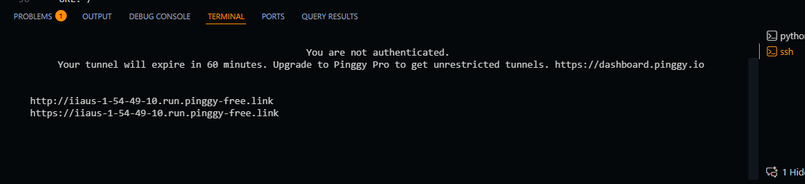

# API Mô Tả Ảnh Bằng AI

## 1) Thông tin sinh viên
- Họ và tên: Lê Phạm Đăng Khiêm
- MSSV: 24120341
- Lớp: 24CTT3B
- Môn học: Tư duy tính toán

## 2) Tên mô hình và liên kết Hugging Face
- Tên mô hình: Salesforce/blip-image-captioning-base
- Liên kết mô hình: https://huggingface.co/Salesforce/blip-image-captioning-base

- Mô hình dịch thuật: Helsinki-NLP/opus-mt-en-vi
- Liên kết mô hình dịch thuật: https://huggingface.co/Helsinki-NLP/opus-mt-en-vi

## 3) Mô tả ngắn về chức năng hệ thống
Hệ thống dùng FastAPI để cung cấp API phân tích ảnh. Người dùng gửi dữ liệu ảnh đến endpoint /generate, hệ thống sẽ dùng mô hình BLIP để tạo mô tả ngắn (caption) cho ảnh đó.

## 4) Hướng dẫn cài đặt thư viện
Yêu cầu Python 3.10+.

Nếu cần cài trực tiếp:

```powershell
pip install torch transformers pillow fastapi uvicorn requests
```

## 5) Hướng dẫn chạy chương trình
mở terminal, điều hướng đến thư mục chứa file api_sever.py và test_api.py.

terminal 1:
Chạy server FastAPI:

```powershell
python api_server.py
```
Bước phụ: Nếu bạn muốn mở server ra ngoài bằng Pinggy, chạy lệnh này trong terminal, không phải trong file Python:

```powershell
ssh -p 443 -R0:127.0.0.1:8000 a.pinggy.io
```

Sau khi chạy thành công, Pinggy sẽ in ra một URL công khai để truy cập server từ bên ngoài.

Thường bạn chỉ cần dùng đúng URL Pinggy được cung cấp, ví dụ: http://hyziz-1-54-49-10.run.pinggy-free.link/
Không thêm `:8000` vào URL public đó. Bạn có thể truy cập các endpoint như: http://hyziz-1-54-49-10.run.pinggy-free.link/health hoặc http://hyziz-1-54-49-10.run.pinggy-free.link/generate

terminal 2:
Chạy client test:

```powershell 
python test_api.py <duong_dan_anh> [<url_server>]
```
ví dụ:

```powershell
python test_api.py coggy.jpg http://hyziz-1-54-49-10.run.pinggy-free.link/generate
```
Trong đó, `coggy.jpg` là đường dẫn đến ảnh bạn muốn phân tích. Bạn có thể thay bằng bất kỳ ảnh nào khác trên máy tính của bạn.
Ảnh corgi và hama.jpg đã được cung cấp sẵn trong thư mục, bạn có thể dùng thử.
Nếu bạn không cung cấp `<url_server>`, mặc định sẽ là http://127.0.0.1:8000/generate.
Lưu ý: Nếu bạn muốn thử ảnh khác ngoài 2 ảnh mẫu, hãy chắc chắn rằng ảnh đó có kích thước nhỏ hơn 4MB và nằm trong thư mục cùng cấp với file này để tránh lỗi khi gửi yêu cầu.

Sau khi chạy thành công, server có thể truy cập tại:
- http://127.0.0.1:8000/ (trả về giới thiệu hệ thống)
- http://127.0.0.1:8000/health (kiểm tra trạng thái hệ thống)
- http://127.0.0.1:8000/generate (gọi API phân tích ảnh)

## 6) Hướng dẫn gọi API và ví dụ request/response

### 6.1 Endpoint root
- Method: GET
- URL: / 
- Chức năng: Giới thiệu hệ thống và endpoint có sẵn.

Ví dụ response:

```json
{
	"system": "Đây là hệ thống API demo với FastAPI.",
	"ai image": "Module AI sử dụng mô hình Salesforce/blip-image-captioning-base để phân tích ảnh và tạo mô tả ngắn nhất.",
	"ai translate": "Module AI sử dụng mô hình Helsinki-NLP/opus-mt-en-vi để dịch từ tiếng Anh sang tiếng Việt.",
	"endpoints": {
		"root": "/",
		"health": "/health",
		"generate": "/generate"
	}
}
```

### 6.2 Endpoint health
- Method: GET
- URL: /health
- Chức năng: Kiểm tra AI đã nạp thành công hay chưa.

Ví dụ response thành công:

```json
{
	"status": "ok",
	"message": "Hệ thống AI đã tải thành công và đang hoạt động!"
}
```

### 6.3 Endpoint generate
- Method: POST
- URL: /generate
- Chức năng: Nhận dữ liệu ảnh và trả về mô tả ảnh.

Body JSON:

```json
{
	"image_bytes": [137, 80, 78, 71, 13, 10, 26, 10, ...]
}
```

Ví dụ gọi bằng Python (requests):

```python
import requests

API_URL = "http://127.0.0.1:8000/generate"
image_path = "coggy.jpg"

with open(image_path, "rb") as f:
		image_bytes = f.read()

response = requests.post(API_URL, json={"image_bytes": list(image_bytes)})
print(response.status_code)
print(response.json())
```

Ví dụ response thành công:

```json
{
	"Phân tích ảnh thành công": {
		"english": "a dog laying in the sand on a beach",
		"vietnamese": "♪ Một con chim bồ câu trên bãi biển ♪" 
	}
}
```
-> Dịch hơi sai, có thể do mô hình dịch chưa hoàn hảo, nhưng ý chính là "Một con chó nằm trên cát ở bãi biển"

Ví dụ response lỗi:

```json
{
	"error": "Thiếu 'image_bytes' trong yêu cầu."
}
```

## 7) Liên kết video demo
Bạn có thể xem video demo tại đây:

### YouTube
[](https://youtu.be/7s5cMaNOnK8)

Hoặc mở trực tiếp qua link: https://youtu.be/7s5cMaNOnK8

## 8) Cấu trúc file chính
- api_server.py: Server FastAPI và các endpoint.
- api_AI.py: Xử lý mô hình AI (load model, health check, phân tích ảnh).
- test_api.py: Script gọi thử endpoint /generate.
- requirements.txt: Danh sách thư viện cần cài.
